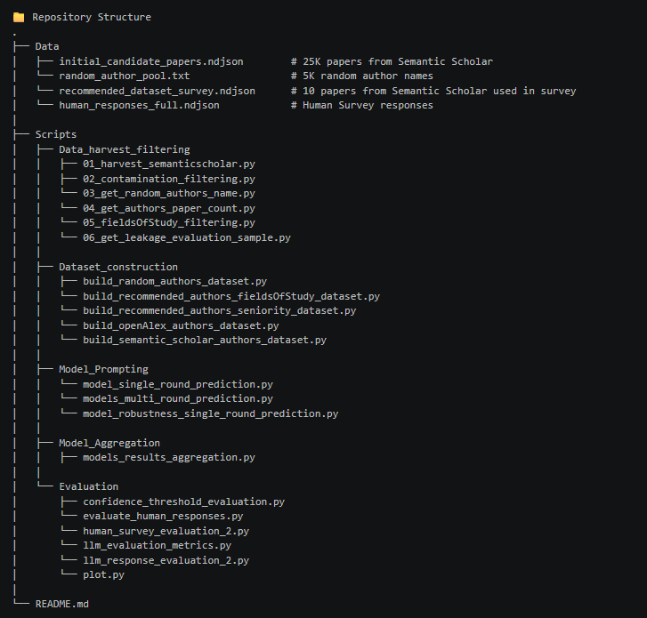

Paper Experiment Repository

Large Language Models Threaten Double-Blind Review

This repository contains a full experimental pipeline for evaluating LLM-based author attribution under double-blind review conditions. It integrates confidence-aware ranking, dynamic-K evaluation, ensemble aggregation, and debate-based reasoning.

The framework goes beyond traditional Top-K evaluation by modeling uncertainty, belief accumulation, and inter-model disagreement.




🔄 Experimental Workflow

Data Harvesting & Filtering
        │
        ▼
Dataset Construction
 ┌─────────────────────────────────────────┐
 │ Random & Thematic authors Dataset       │
 │ Senior & Junior authors Dataset         │
 | Disciplines Dataset                     |
 └─────────────────────────────────────────┘
        │
        ▼
Confidence Ranking (LLM)
        │
        ▼
Confidence-Aware Evaluation
        │
        ▼
Debate & Aggregation
        │
        ▼
Final Evaluation & Analysis


🧠 Experiment Overview

This project evaluates whether Large Language Models can infer the true author of a scientific paper using only its title and abstract.

It systematically studies:

- Attribution accuracy
- Model confidence calibration
- Sensitivity to distractor difficulty
- Inter-model disagreement

⭐ Key Contributions
- Confidence-based ranking instead of fixed Top-K
- Dynamic-K evaluation via cumulative belief thresholds
- Model aggregation without retraining
- Debate-based reasoning for disagreement resolution
- Statistical testing and calibration analysis

⚙️ Prerequisites

- Python 3.9+
- Ollama running locally
- Required libraries (install via `pip`):

```bash
pip install pandas numpy scikit-learn statsmodels matplotlib ndjson requests
```

1️⃣ Data Harvesting & Filtering
Scripts for collecting and cleaning paper metadata from Semantic Scholar.

01_harvest_semanticscholar.py
- Fetches papers across multiple disciplines
- Stores title, abstract, and author metadata

```bash
python Scripts/Data_harvest_filtering/01_harvest_semanticscholar.py
```
Output:
initial_candidate_papers.ndjson

02_contamination_filtering.py
- Removes papers previously posted as arXiv and medRxiv preprints
- Uses fuzzy title matching + arXiv and medRxiv API

```bash
python Scripts/Data_harvest_filtering/02_contamination_filtering.py
```
Output:
filtered_papers_curated.ndjson

03_get_random_authors_name.py
- Builds a pool of random authors from diverse fields

```bash
python Scripts/Data_harvest_filtering/03_get_random_authors_name.py
```
Output:
random_author_pool.txt

04_get_authors_paper_count.py
- Computes the number of papers each author has published based on the harvested data.

```bash
python Scripts/Data_harvest_filtering/04_get_authors_paper_count.py
```
Output:
dataset_paper_count.ndjson

05_fieldsOfStudy_filtering.py
- Filters papers based on academic disciplines / fields of study.

```bash
python Scripts/Data_harvest_filtering//05_fieldsOfStudy_filtering.py
```
Output:
filtered_computer_science_papers.ndjson OR filtered_medicine_papers.ndjson


2️⃣ Dataset Construction
Random Distractors

build_random_authors_dataset.py
- 1 true author + 4 random distractors
- No thematic overlap
- Tests surface-level model behavior

```bash
python Scripts/Dataset_construction/build_random_authors_dataset.py
```
Output:
fifty_author_id_dataset_random.ndjson

Thematic Distractors

build_recommended_authors_dataset.py

Uses Semantic Scholar recommendations
- 1 true author + 4 thematically similar distractors
- Tests deep semantic attribution

```bash
python Scripts/Dataset_construction/build_recommended_authors_dataset.py
```
Output:
author_id_dataset_recommended.ndjson


Fields Of study

build_recommended_authors_fieldsOfStudy_dataset.py

Filtered fi
- papers' authors publication counts
- Split datasets into Senior and Junior as true author

```bash
python Scripts/Dataset_construction/build_recommended_authors_fieldsOfStudy_dataset.py
```
Output:
computer_science_dataset_recommended.ndjson OR medicine_dataset_recommended.ndjson


Authors Seniority

build_recommended_authors_seniority_dataset.py

Uses Semantic Scholar to get
- papers' authors publication counts
- Split datasets into Senior and Junior as true author

```bash
python Scripts/Dataset_construction/build_recommended_authors_seniority_dataset.py
```
Output:
junior_author-count_id_dataset_recommended.ndjson OR senior_author-count_id_dataset_recommended.ndjson


3️⃣ Model Prompting (LLM Inference)
model_single_round_prediction.py

Purpose:
Query LLMs to rank candidate authors and assign calibrated confidence scores.

Key Features
- Strict JSON output enforcement
- Parallel inference
- Suspect set accuracy computation
- True-author confidence extraction

```bash
python Scripts/Model_Prompting/model_single_round_prediction.py \
  --data_file path/to/input_dataset.ndjson \
  --output_file path/to/output_results.ndjson \
  --log_file path/to/run.log \
  --model llama3:70b \
  --workers 8
```


models_multi_round_prediction.py
Reasoned Consensus

Core Idea:
Disagreement between strong models is informative.

Debate Protocol
🟦 Round 1 — Independent Judgments

One model:
- Ranks authors
- Assigns confidence (sum = 1)
- Provides brief reasoning

🟥 Round 2 — Second reasoning

- One Model critique another model’s reasoning
- Rankings may be revised

Final Output
- Revised confidence scores
- Consensus ranking
- Debate occurrence flag

```bash
python Scripts/Model_Prompting/models_multi_round_prediction.py \
  --data_file dataset.ndjson \
  --output_file debate_results.ndjson \
  --log_file debate.log \
  --model_a llama3:70b \
  --model_b qwen2:72b \
  --workers 2
```


6️⃣ Model_Aggregation (Ensemble without Training)
models_results_aggregation.py

Approach
- Sum confidence scores across models
- Normalize into a shared belief distribution
- Re-rank authors
- Robust to malformed or partial outputs.

```bash
python Scripts/Model_Aggregation/models_results_aggregation.py \
  --inputs modelA.ndjson modelB.ndjson \
  --output_file aggregated.ndjson \
  --log_file aggregation.log
```


4️⃣ Confidence-Aware Evaluation (Dynamic-K)
threshold_evaluation.py

Key Idea:
Instead of fixed Top-K, select authors until cumulative confidence ≥ τ.

Dynamic-K Algorithm
- Traverse ranked authors
- Accumulate confidence
- Stop when belief ≥ τ
- Check if true author is included

Thresholds τ ∈ {0.3, 0.4, 0.5, 0.6, 0.7, 0.8, 0.9}

This measures confidence-aware recall and model uncertainty handling.


5️⃣ Statistical Evaluation & Calibration
evaluation_metrics.py

Metrics
- Suspect set Accuracy
- ROC–AUC
- McNemar’s Test (significance)
- True-author confidence distributions

```bash
python Scripts/Evaluation/evaluation_metrics.py \
  --file1 modelA.ndjson \
  --file2 modelB.ndjson \
  --label1 ModelA \
  --label2 ModelB
```
Outputs
roc_plot.pdf
true_author_confidence_boxplot.pdf

6️⃣ SPlot Comparison results (Discipline and seniority)
plot.py

Metrics
- Suspect set Accuracy
- Recall
python Scripts/Evaluation/plot.py
```
Outputs
authorship_analysis_nature.png


🎯 Summary

This repository provides a complete, research-grade pipeline for evaluating LLMs on authorship attribution under uncertainty, disagreement, and ensemble reasoning.

It is suitable for:
- Empirical LLM evaluation
- Confidence calibration studies
- Ensemble reasoning research
- IR / NLP conference submissions